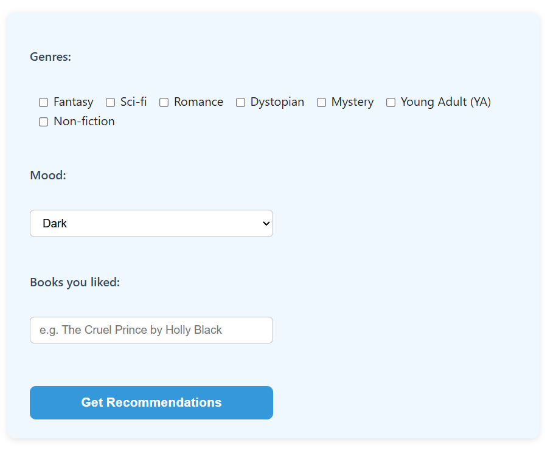

# Book_Recommendations
A smart, lightweight web app that recommends books based on your favorite genres, moods, and titles you've enjoyed. Built with Flask and vanilla JavaScript, it uses a simple AI-driven filtering engine on top of a real-world book dataset.

-Features:
    -Search by genre, mood, or titles you liked
    -Returns top 5 matching book recommendations
    -Keyword and category-based AI filtering
    -Clean, responsive HTML/CSS frontend

Example Use

Input:
    Genre: Romance
    Mood: Heartwarming
    Liked Book: The Cruel Prince

Output:
    Teverton Hall
    The Widow of Larkspur Inn
    Griffin & Sabine

Created by: Flandra Bytyqi